  

🌱 Currently learning **Python, Java, C & Web Development**
🎨 Interested in **Web Design & Graphic Design**
🚀 Learning by building things and experimenting with new ideas
🎮 Gamer who enjoys Story mode games

---

## 🧑‍💻 About Me

* 🌱 Currently learning **Python, Java, C, HTML, Git & GitHub**
* 💻 Exploring **Web Development**
* 🎨 Interested in **Web Designing & Graphic Designing**
* 🚀 Improving my skills one project at a time
* 🎮 Gaming is part of the journey too

---

## 💻 Tech Stack

  

---

## 📊 GitHub Stats

  
  

---

## 🔥 GitHub Streak

  

---

## 🏆 GitHub Trophies

  

---

## 🌐 Connect With Me

  
  
  

---

## 👀 Profile Views

  

---

  💡 <i>Learning today. Building tomorrow.</i>

<!--
**tanmay-cloud67/tanmay-cloud67** is a ✨ _special_ ✨ repository because its `README.md` (this file) appears on your GitHub profile.

Here are some ideas to get you started:

- 🔭 I’m currently working on ...
- 🌱 I’m currently learning ...
- 👯 I’m looking to collaborate on ...
- 🤔 I’m looking for help with ...
- 💬 Ask me about ...
- 📫 How to reach me: ...
- 😄 Pronouns: ...
- ⚡ Fun fact: ...
-->
